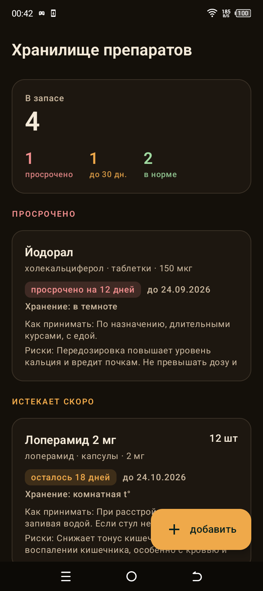
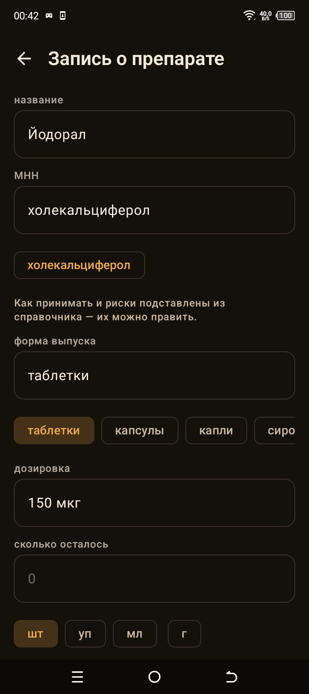
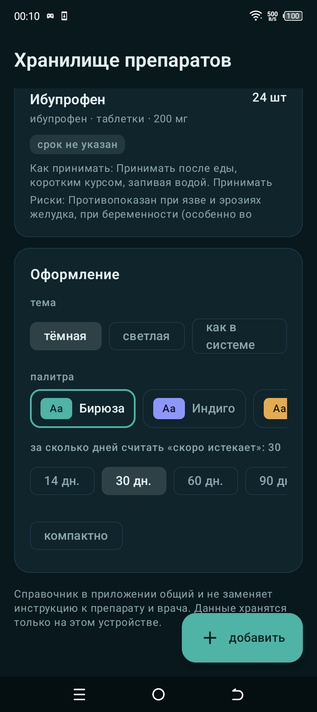

# Хранилище препаратов

Что лежит в аптечке: сколько осталось, какой срок годности, как принимать и на
что обратить внимание. Всё хранится на устройстве, интернет не нужен, разрешений
в приложении нет вообще — включая `INTERNET`.

## Снимки

| Список по срочности | Запись о препарате | Оформление |
|---|---|---|
|  |  |  |

Снимки сделаны с телефона, а не в эмуляторе.

## Зачем отдельное приложение

В «Дневнике давления» (`../chronic-android`) есть препараты — но это расписание
приёма того, что уже назначил врач: время, отметка «принял», adherence. Там нет
ни остатков, ни сроков годности, ни того, что препарат ещё лежит в шкафу.

Здесь другое: домашний запас. Запись — это «что у меня есть», а не «что мне
назначили».

## Что внутри

- **Список по срочности.** Сверху просроченное и то, что скоро испортится, а не
  «по добавлению»: иначе проблема не видна, пока не долистаешь до конца.
- **Срок годности** — выбором даты, а не свободным текстом. Иначе в списке
  появляются «через месяц» и «12.26», которые невозможно сравнить между собой.
  Слово «срок» не указан — отдельная группа внизу, а не пустота вверху.
- **Скоро истекает** — порог настраивается (14 / 30 / 60 / 90 дней).
- **Как принимать и риски** — поля есть у каждой записи. Если МНН совпал со
  справочником, текст подставляется, но только в пустые поля: подсказка не должна
  затирать то, что человек написал сам.
- **Количество и единица** — штуки, упаковки, миллилитры.
- **Оформление** — тема и четыре палитры, меняются на месте, без перезапуска.
  Палитры те же, что в «Дневнике давления» (`../chronic-android`): Эспрессо,
  Графит, Прилив, Бумага, с теми же цветами. Общего кода между приложениями
  нет — они собираются отдельно, поэтому палитры повторяются числами, и при
  правке одной стороны правьте и другую.

## Про справочник

`domain/Reference.kt` — локальный список на 20 распространённых препаратов:
парацетамол, ибупрофен, амоксициллин, метформин, лозартан, аторвастатин,
левотироксин, инсулин, нитроглицерин и другие. Для каждого — как принимать и
риски.

Что это и что это не значит. Тексты — общие сведения о группах препаратов,
которые есть в инструкции к лекарству. Это не назначение, и они не заменяют ни
инструкцию к конкретной упаковке, ни врача. Поэтому тексты копируются в запись
и остаются редактируемыми: справочник не переписывает решение человека.

Почему локально, а не из сети: отправить список лекарств куда-то — значит
отправить его кому-то. Приложение этого не делает вообще.

Если препарат в справочнике не найден, поля всё равно остаются: приложение
предлагает заполнить их сам и не выдумывает текст за человека.

## Тесты

```
.\gradlew.bat :app:testDebugUnitTest
```

11 тестов на доменную часть: склонение сроков (1, 2, 4, 5, 11, 12, 21, 22 дня —
там оно и ломается), битая дата не роняет разбор, порог «скоро» меняется,
подбор справочника по МНН и по торговому синониму, у каждой записи есть и
приём, и риски.

Склонение проверяется отдельно не для красоты: в первой версии подпись
собиралась из двух кусков и давала «осталось 5 дн. дней».

## Сборка

Нужны JDK 21 и Android SDK (платформа 35). Путь к SDK — в `local.properties`,
файл локальный и в репозиторий не попадает.

```
.\gradlew.bat :app:assembleDebug
.\gradlew.bat :app:assembleRelease
```

Подпись релиза — `keystore.properties` рядом с проектом. Он тоже локальный:
иначе любой смог бы выпускать обновления от вашего имени. Если файла нет,
релиз подписывается отладочным ключом — APK устанавливается, но это не ваш
ключ, поэтому для постоянных обновлений `keystore.properties` нужен.

## Иконка

Одна капсула, один цвет, без градиентов и деталей. Повёрнута на 45° и целиком
вмещается в безопасную зону adaptive icon (круг радиусом 36 от центра), дальние
точки силуэта отстоят от центра на 26. Поворот сделан через `<group>`, чтобы
координаты читались как обычная капсула.

`mipmap/ic_launcher.xml` и `ic_launcher_round.xml` — для Android 5–7, где
adaptive icon ещё не поддерживается: `minSdk` 23, без них иконки там просто не
было бы.